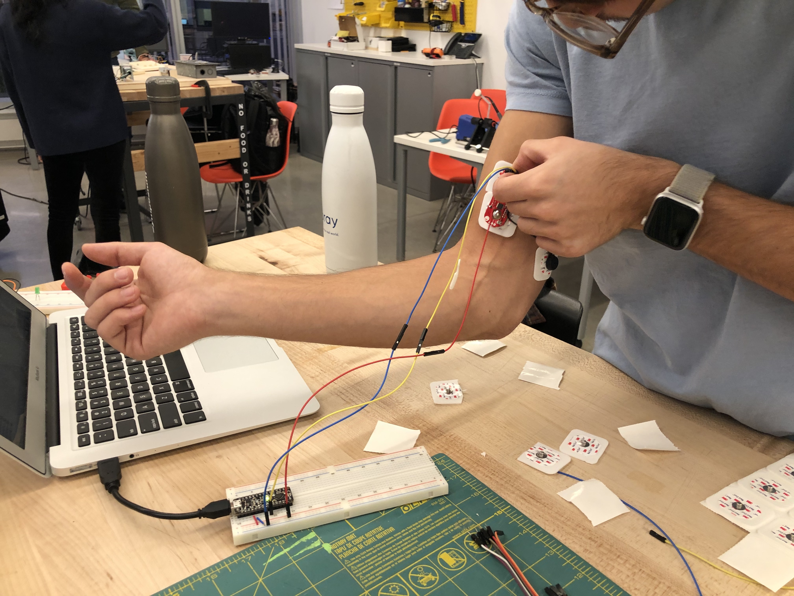
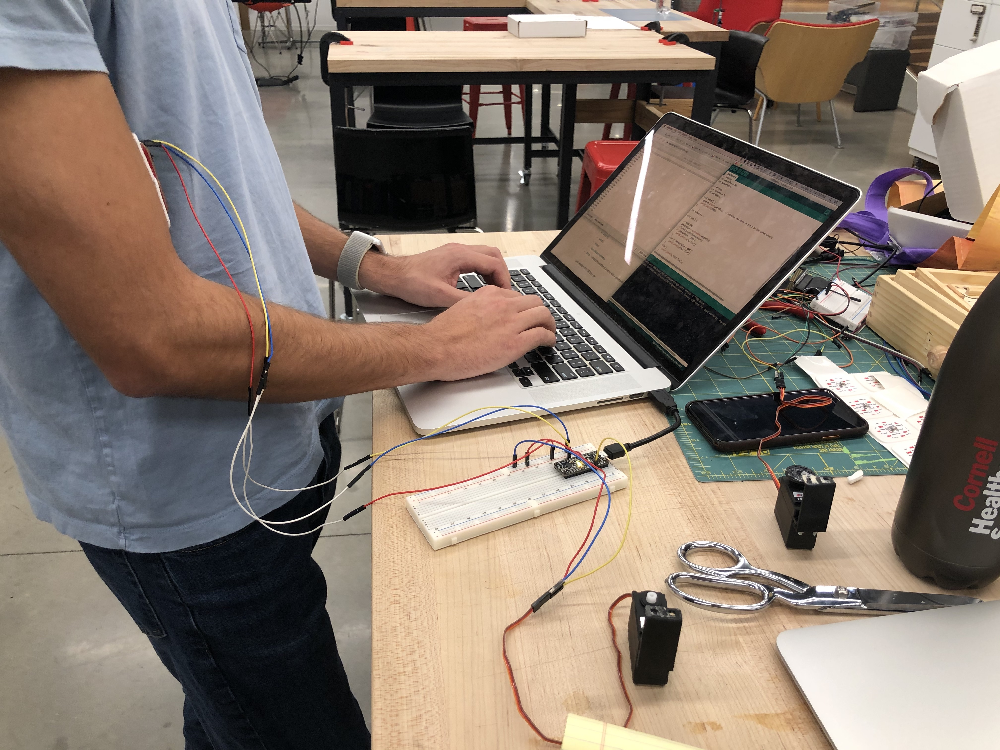

# labyrinth

## Description

Forget solving puzzles with your brain, solve puzzles with your muscles. We're solving the Labryinth maze using EMGs to control the x/y tilting of the puzzle. The EMGs will read a signal from each of the user's forearm muscles based on the user's flexing of the muscles. This signal will translate to x or y axis rotation performed by servo motors hooked up to the game.

## Team
* Zach Gittelman
* Dan Witte (danwitte)

## Prototype

We're gonnna need longer cables

## Parts

* Arduino
* 2 x continuous servos
* 2 x EMGs
* 2 x 3d printed servo mounts
* 6 Electrodes
* 9v battery

## Interaction Plan

Setup: Users will need to attach 6 electrodes, 3 to each arm. Once the electrodes are connected, the user will to test their ability to rotate the servos and get use to the controls. 

Play: Once users are ready to play, they (or possibly someone else) will need to drop the marble in the maze. The left arm EMG will controll the Y axis, the right arm EMG will control the X axis. Flexing will increase the angle (turn the servo clockwise), half flexing will bring the servo to a stand still, and relaxing the muscle will decrease the angle (turn the servo counter clockwise). Users lose if the marble falls through a hole or they get too tired of flexing :muscle:. Users win if they manage to get the marble to the end of the maze.

## Progress

[Single servo hookup](https://photos.app.goo.gl/kSsvtbHaXER2PTeY9)
[Two servos hooked up](https://photos.app.goo.gl/J16m6d5j8TJG6g228)
